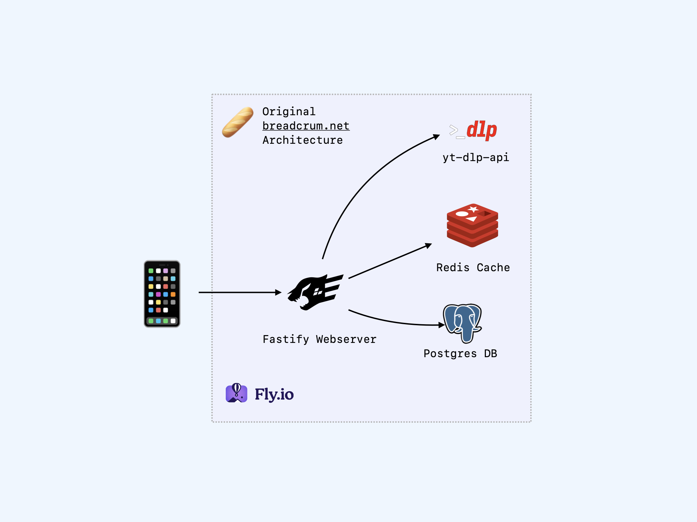
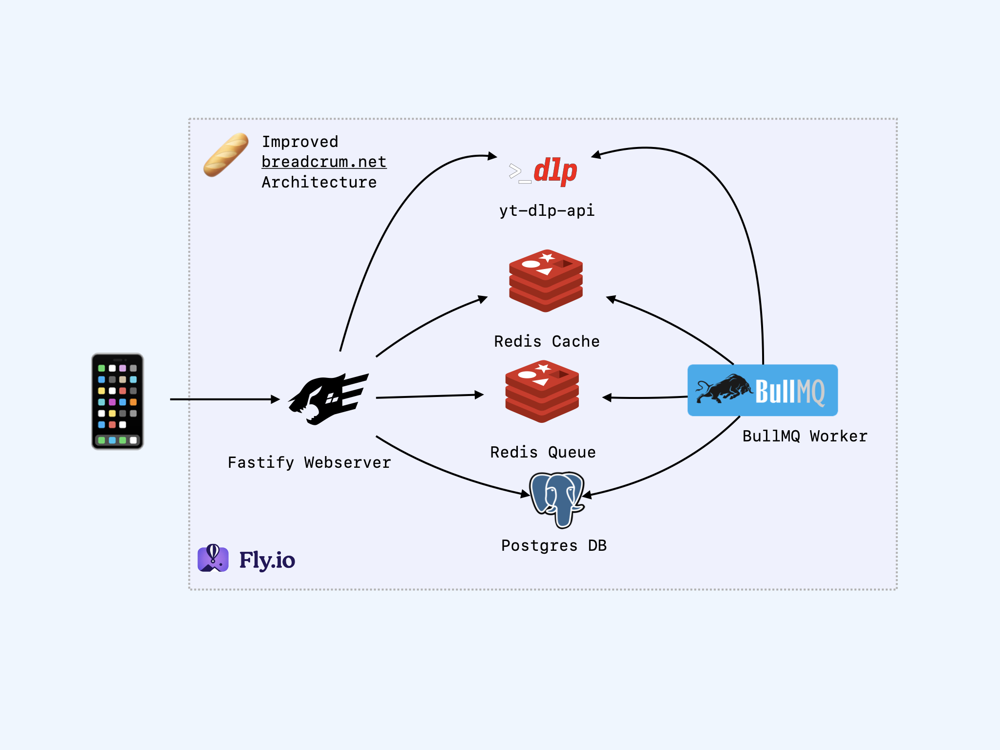
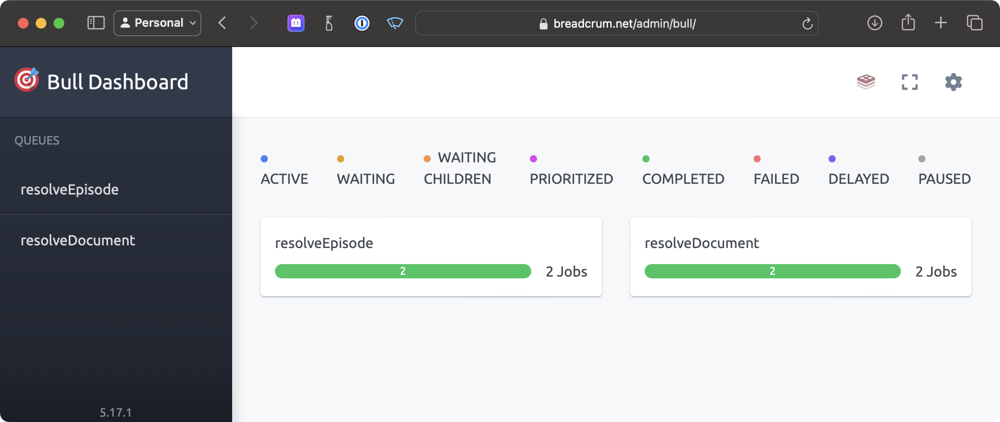

Breadcrum has finally shipped a new and improved backend architecture!
These changes bring immediate performance and reliability improvements and also lay the foundation for the next round of exciting features.

## The Original Setup

One of the primary design goals of Breadcrum was to build using proven, reliable technology and patterns while still utilizing the time-saving features modern technologies offer.

<figure>
  
  <figcaption>The original launch architecture of breadcrum.net. Simple and effective.</figcaption>
</figure>

- A [Fastify][fastify] ["API First"](https://www.postman.com/api-first/) API server.
  - Provides 100% of the APIs needed to implement a Breadcrum client.
  - Fully validated endpoint schemas with [JSONSchema](https://json-schema.org) and [OpenAPI 3.0](https://spec.openapis.org/oas/v3.0.3).
- A [Postgres][postgres] relational database.
  - Breadcrum's primary service is storing related data for users. Postgres is the best tool for that.
- A [Redis](https://redis.io) cache for rate limiting and short-lived cache storage.
- A dedicated private [yt-dlp-api](https://github.com/hifiwi-fi/yt-dlp-api) service.
  - Provides a long-running Python process since loading [yt-dlp](https://github.com/yt-dlp/yt-dlp) per request was too slow.
- A [top-bun](https://top-bun.org) multi-page JAMStack style web app client.
- Hosted on [fly.io](https://fly.io) using [Alpine Linux](https://www.alpinelinux.org) Docker containers.
- Continuous integration and deployment run on [GitHub Actions](https://docs.github.com/en/actions).

This implementation served its purpose well.
It was simple to set up and reliable.
Despite omitting some common conventions (SSR, CDN, [TypeScript][ts] etc), it never felt like it prioritized short-term productivity at the cost of long-term flexibility.
Building and maturing on top of this base has been a pleasure.

There were a few pain points:
- If the server ever crashed, all in-flight jobs and work were lost and would not recover after a reboot.
Server-resolved bookmark details, website archive extraction, and episode resolution would be dropped and none of the resources would finish resolving.
Users would have to manually retry creating them if it was noticed.

- Resource scaling was uneven. Requests that triggered work-heavy jobs, like processing a large website, could slow down other requests or crash the server if it hit the out-of-memory supervisor limit.
The server resources needed to cover 99% of requests safely and quickly were much smaller than those needed to cover the last 1% of heavy workload requests.
To avoid these problems, provisioning for the 1% case was necessary.

## The New Setup

<figure>
  
  <figcaption>Improved Breadcrum architecture. Slightly more complex, but much more capable.</figcaption>
</figure>

- A [BullMQ][bullmq] worker service (wrapped as a Fastify service).
- Two Redis instances: a volatile shared cache and a [NOEVICT](https://redis.io/docs/reference/eviction/#eviction-policies) instance for the queue.
- High availability, single-region Postgres server.

### The Worker

The worker process is a second Fastify service that spins up a few [BullMQ][bullmq] queue workers.
These connect to a new dedicated Redis instance that tracks queued jobs and allows workers to coordinate which process takes which job.

Async task queues are nothing new. You put details about a "job" into a queue, and a worker picks up the job as soon as possible.
They offer many useful features that make processing tasks and jobs easier to reason about:

- Durability
  - If a worker dies during a job, the job queue notices and can retry the job on the next available worker according to configurable rules.
- Scalability
  - Spinning up new workers is easy and increases throughput and parallelism. If falling behind, just scale up by adding workers.
- Scheduling
  - Jobs can be scheduled based on dates and time offsets. Implementing features like "retry when this video goes live" becomes a trivial, reliable scheduling task in the work queue.
- Asynchronous processing
  - API endpoints can support long-running tasks without holding HTTP connections open, and the Job IDs used to track work pair perfectly with asynchronous API endpoint patterns.
- Progress awareness
  - Job workers can report progress at the individual job level.
- Observability
  - The queue system includes built-in observability tools to monitor queue progress. It also tracks completed and failed job history for later investigation.
- High elasticity
  - Workers can scale to zero when no work is pending and wake up when needed. Large jobs can dynamically provision more expensive resources and release them when finished.

<figure>
  
  <figcaption>BullMQ ships with drop-in tools that allow queue operators to inspect the state of the queue.</figcaption>
</figure>

With distributed queues, you can handle almost any workload exposed through an API. Now that Breadcrum has this capability, we can start tackling more challenging features like inserting scheduled videos into your feeds when they become available, rather than requiring the user to manually create an episode.
Downloading large chunked HLS video playlists, re-muxing them into podcast-friendly formats, and uploading to affordable cloud hosting also becomes feasible with a work queue.

More importantly, the API server is doing less heavy lifting and is at lower risk of running out of memory on large jobs.

### Shared Cache

The second Redis instance serves the original role: a place to store shared cache values.
Now that there are two servers (web and worker), it's advantageous to store cached values in a way that both can read and write.
This is important if either service needs to scale up and requires a form of 'shared memory' between instances. It's also useful for sharing expensive chunks of work between services, like looking up short-lived media URLs.

### A Workspace Appears

<figure>
  
  <figcaption>Breadcrum now has two dependent processes with shared code in the middle.</figcaption>
</figure>

With the additional complexity of managing two services that operate in lockstep, Breadcrum has adopted an [npm workspaces](https://docs.npmjs.com/cli/v7/using-npm/workspaces) pattern.
Monorepos/workspaces have advantages and disadvantages that are out of scope for this post, but one way to think of them is they let you work on multiple independent packages that depend on common parts without a module publishing step in between.
To get this advantage, everything has to work out of a single repository.

### TS-in-JS

Finally, Breadcrum has adopted [TS-in-JS](https://github.com/voxpelli/types-in-js) patterns.
It's not fully passing type checks yet, but the tooling is set up and in use during development.
This setup provides the advantages of TypeScript without the hassle or confusion of a build step.
The cost of TypeScript builds is non-trivial, with a new category of [VC-funded](https://turbo.build/repo) [startup](https://nx.dev) products dedicated to easing this pain.
Breadcrum does not have the budget for that cost, so TS-in-JS avoids it by accepting a slightly less expressive syntax in favor of everything working by default.

## Conclusion

These architectural improvements will serve as the foundation to reliably deliver the next wave of features on the Breadcrum roadmap.

[fastify]: https://fastify.dev
[postgres]: https://www.postgresql.org
[bullmq]: https://bullmq.io
[ts]: https://www.typescriptlang.org

*[SSR]: Server side rendering
*[CDN]: Content delivery network
