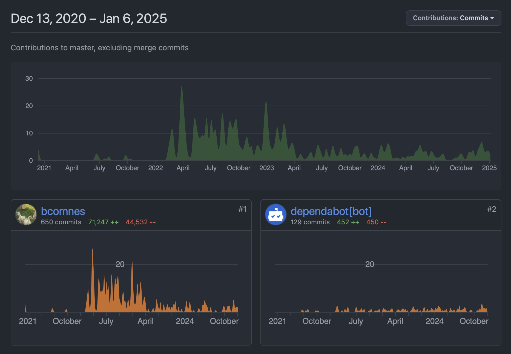
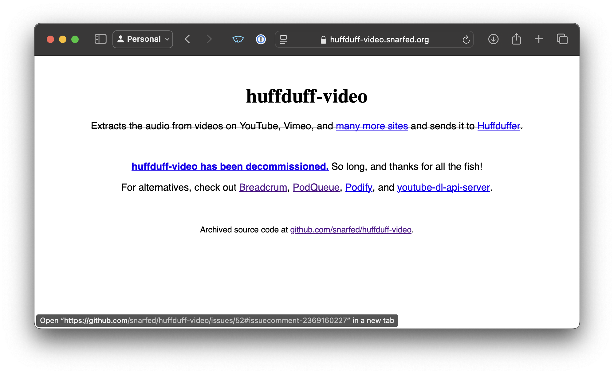

Breadcrum is entering 2025, its 4th year (3rd year in operation)!
Let's take a quick look at how things went last year, what got done, and chat about the future of the project.

## By the Numbers

<figure>
  
  <figcaption>Looks like 2024 was another slow and steady year 🐢.</figcaption>
</figure>

Breadcrum recently passed two major milestones:

### 🚀 100+ Users

We crossed the 100-user mark just before the year ended—a big leap from last year's 31 users. Thank you to everyone who's joined and made Breadcrum part of your media workflow!

<blockquote class="twitter-tweet">
100 users! Happy New Year! 🥳 <a href="https://t.co/UYzIxJ9Ukc">https://t.co/UYzIxJ9Ukc</a> <a href="https://t.co/LSHdGNrFZv">pic.twitter.com/LSHdGNrFZv</a>
&mdash; 🥖 Breadcrum (@breadcrum_) <a href="https://twitter.com/breadcrum_/status/1874244625650901170?ref_src=twsrc%5Etfw">January 1, 2025</a></blockquote> 

### 🔗 10k+ Bookmarks

Breadcrum now hosts over 10,000, hand-whittled bookmarks!
People have clicked this button over 10k times.
It's doing something useful! Tags, Episodes and Archives of course, will always trail this number.

|           | 2021 | 2022 | 2023 | 2024 |
|-----------|------|------|------|------|
| Users     | 0    | 8    | 31   | 105  |
| Bookmarks | 0    | 2070 | 6304 | 10406|
| Tags      | 0    | 235  | 597  | 1085 |
| Episodes  | 0    | 1175 | 3579 | 5871 |
| Archives  | 0    | 0    | 1575 | 3548 |

## Welcome huffduff-video Users

Recently, a popular service called huffduff-video [shut down](https://github.com/snarfed/huffduff-video/issues/52#issuecomment-2369160227) after YouTube rolled out aggressive anti-bot measures.

<figure class="borderless">
  
  <figcaption>Huffduff-Video notice of shutdown.</figcaption>
</figure>

### Trouble ahead for yt-dlp

YouTube is essentially cable TV now, and they want you watching logged in, in Chrome, without ad blockers, or using their tedious native app.

To enforce this, they've made it difficult for non-residential IP addresses to negotiate public content on behalf of users.
Additionally, many requests require running various forms of device attestation to make sure you are running in Chrome or Android.

Python based tools like yt-dlp struggle to perform these actions because it requires a full browser-like environment to reasonably satisfy these requirements.

In order to interact with content on YouTube, it's increasingly clear that a sandboxed DOM/JS based runtime is required.
It's likely these device attestation measures will only increase with time.

### Breadcrum Stepped Up

Since Breadcrum is primarily a Node.js application, it was able to integrate [YouTube.js](https://ytjs.dev/) quickly as an alternative to [`yt-dlp`](https://github.com/yt-dlp/yt-dlp). As a result, Breadcrum has remained, so far, operational in the face of these recent changes.

`yt-dlp` is still used for nearly over other media integration within Breadcrum and is a wonderful project.

### A Bit of History

huffduff-video was inspired by discussions I had with [Ryan Barrett](https://snarfed.org/2015-03-07_huffduff-video) on the [Indieweb](https://indieweb.org/IndieWebCamps) IRC channel.
We were exploring ways to easily get content onto smartphones, and podcast apps became a clever solution—a wormhole for moving content onto any device.

I'm thrilled to see more people adopt this pattern, and I hope Breadcrum can continue where huffduff-video left off!

### How Breadcrum Differs

While huffduff-video focused on passive sharing via Huffduffer, Breadcrum offers a private feed experience with expanded media support for videos and articles.
If you're a migrating huffduff-video user, I'm especially eager to hear about your experience and what features you'd love to see next.

## What Goals?!

It's been an especially hectic year for me personally.
Family life and career have been my primary focus, so I'm mildly sad to say most of the goals I set out for Breadcrum in 2024 were not met.

A lot did get done though:

- 🌎 Breadcrum the service is still online!
- 🪙 It is still inexpensive to operate.
- 🐂 Dramatically improved back-end architecture that scales very efficiently.
- 📆 Scheduled episodes (~~currently broken~~ fixed again).
- 🦋 BlueSky Video Support.
- 🐦 X Video Support started working again.
- 📀 Pluggable media extraction backend (YouTube not broken yet).
- 👨‍💼 Refactoring to use TypeScript (This wasted so much time, but should help things later).
- 💬 Discord Chat.
- 📚 Blog post comments section.
- 🥺 Accepting Donations.
- 🤖 PWA/Android share sheet support.
- 🧑‍💼 Admin panel with administrative tools.

Rather than emphasizing specific features this year, here are the general themes and directions I think Breadcrum needs to focus on.

### 💸 Sustainability: Paid accounts

I hope there are enough of you who enjoy the service enough to pay a little every year to help keep the computers and storage running.

### 📦 Data ownership: Import/Export

As a service, this is a minimum requirement. The data you create here is yours, and I would also love to host any existing data you may already have.

### 📼 Resiliency: Better Data Guarantees

With users and a budget, it's time to start incurring the costs of tighter data guarantees. The worst-case scenario right now is that 24 hours of data might be lost due to hardware failure. I can get this down to 0 and plan to before asking for money.

### 📣 Prioritized feature development

With the additional channels of communication, I hope to use feedback from users to prioritize feature development.

## Happy 2025!

<figure>
  
  <figcaption>The 2024 view out of the new Breadcrum HQ.</figcaption>
</figure>

Thank you for being part of Breadcrum's journey! Your support and feedback have been invaluable, and I'm excited to keep building and improving the service with your input.

Whether you're a longtime user or just getting started, I'd love to hear from you:
- What's working well?
- What could be better?
- What new features would make Breadcrum even more useful for you?

Let's make 2025 the year Breadcrum becomes an essential tool in your web media workflow.

Join the conversation in our [Discord]({{ vars.discordUrl }}) or drop me a message on [Twitter]({{ vars.siteTwitterUrl }}), [Mastodon]({{ vars.mastodonUrl }}), or [BlueSky]({{ vars.bskyUrl }})!
Here's to making the media firehose a little more manageable.

## Syndication

- [Mastodon](https://fosstodon.org/@breadcrum/113822413536530534)
- [X](https://x.com/breadcrum_/status/1878868571918569806)
- [Bsky](https://bsky.app/profile/breadcrum.net/post/3lfnduaerfk2j)
