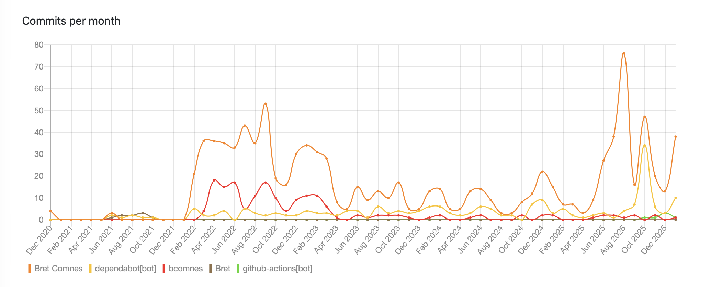
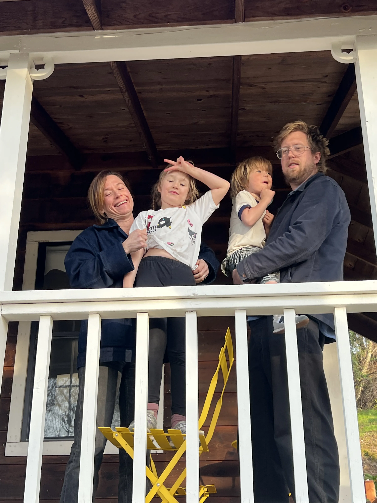

Breadcrum is entering 2026, its 4th year of live operation!
Let's take a quick look at how 2025 went, what shipped, and where things are headed.

In general, 2025 was kind of a blowout year.
The project suffered two major setbacks: 

- Popular media websites made it more [difficult to interact](/blog/2025/whats-going-on-with-episodes/) with media, requiring significant engineering effort to even continue to work.
- The frontend framework used for breadcrum [had to be swapped out](/blog/2025/frontend-rewrite/).

Both of these challenges were unplanned, and due to their nature, and the nature of available time I have on this project, ate up a significant portion of the year.

On top of a lot of other personal responsibilities (moving again, most of my focus being applied on my [primary project](https://socket.dev), my kids getting old enough to start needing more of their Dad), I didn't meet many of the milestones I hoped to. 

All that said though, I still love the project and plan to continue it as it's become a core tool for me and a number of you.

## By the Numbers

<figure>
  
  <figcaption>Commit count is up in 2025!</figcaption>
</figure>

|           | 2022 | 2023 | 2024  | 2025   |
|-----------|------|------|-------|--------|
| Users     | 8    | 31   | 100   | 201    |
| Bookmarks | 2,070| 6,303| 10,244| 18,245 |
| Tags      | 235  | 597  | 1,091 | 1,697  |
| Episodes  | 1,175| 3,579| 5,883 | 11,495 |
| Archives  | 0    | 1,575| 3,573 | 5,375  |

Breadcrum doubled its user count and didn't quite double the number of bookmarks from last year. Onboarding was still very rough, but quite a few people have stuck around on a monthly basis.

## 2025 Highlights

- Android support: PWA Share Target support for inter-app saves via Chromium on Android.
- Keyboard shortcuts: Cmd/Ctrl+Enter form submit shortcut across the app.
- Page transitions for smoother navigation.
- Syndication links and better docs breadcrumbs.
- Legal! We have a privacy policy, terms of service, etc.!
- Admin tooling improvements: cache flush panel, richer user admin views, internal stats, and user agent tracking.
- Auth token management (endpoints + UI work-in-progress).
- Bookmark, Episode and Archive resolution status, with UI polling.
- Nightly full database backups and database scaling. Your data is safe.
- More efficient infrastructure. Work queue migration to pg-boss (removed bullMQ and extra redis instances).
- Observability upgrades: OpenTelemetry metrics and dashboard work. I can see more when things are going wrong.
- Preact rewrite with client-side TypeScript checks enabled.
- Project is fully type-checked.
- Content and UX fixes across episodes, search, bookmarks, and archives.
- Episode extraction stability work in `yt-dlp-api`: tracked youtubei.js churn, Redis-backed session caching, and a dedicated onesie worker pool.
- `extract-meta` refresh: moved to Node LTS focus and updated jsdom/types tooling.
- Bookmarklet updates: removed sourcemaps and bumped `@breadcrum/extract-meta`.
- Tooling shifts: Node upgrades and switch to pnpm.
- Passkey support.
- Expanded docs.
- CF Turnstile for registration: We had our first spammers!
- Admin user management tools (for dealing with spam).
- Improved registration validation feedback.
- Improved on-site bookmark add UI.

## Community and Sustainability

If you haven't yet, join the [Discord](https://discord.gg/pYJdTvNdZN). 
I really would love to hear what works and doesn't work for you.
If you enjoy the project and want to see it continue, please [donate](/docs/donate/)!
This is a passion project, however there are costs involved and the more everyone wants to help cover those costs, the more interesting things I can get done here.

## A note on AI

It would be a major omission to not discuss AI in 2025.
The models continued to improve, and we saw a ton of innovation around their "agentic" abilities (e.g. writing in editors, using tools, supplementing context with network calls, etc).
I am under tremendous professional pressure to onboard onto this technology in my career, and I certainly have. 
They are too useful to ignore.

I understand these developments are not without controversy. 
I understand the moral issues around big tech finding another arbitrage opportunity to undermine and plunder independent creatives at an unprecedented scale.
I wish this technology was introduced and developed in a more fair way.

The cat is out of the bag, the ship has sailed.
It was trained on everyone's open source code. 
It was trained on code my industry and community idols wrote.
It was trained on code I contributed to.
It was trained on code I originated (maybe?)
I haven't seen a dime of direct compensation for this (though I wouldn't expect it).
I'm certainly as impacted by the moral angle of it all as anyone else is.

I can't stress enough what a seismic shift this technology is. 
On the scale of the internet.
It automates the two most tedious parts of software engineering: context gathering, and typing out code (mostly).
People are trying to apply it to the other aspects of engineering, with some impressive success (and a lot of failure/mediocre results), but those two aspects are what I've personally found consistent advantage in. I expect it to improve as time goes on, and it's unclear where the ceilings are, though I'm sure there are some. 
People's distaste for engaging with AI-generated content is warranted, though it's also possible to use it to curve fit against hand-written code to arrive at a result as intentional as hand-written code.

Here is what I'm trying to say: I am using AI agents to accelerate development outcomes on Breadcrum now. 
It's not "vibe" coding. 
I'm involved with every line that comes out of it.
I curve fit the prompts against the context of 4 years of hand-written code. 
If something becomes un-deliberate or crappy, I delete it.
Results speak louder than words, so here is a short list of AI-assisted features I shipped since the start of 2026:

- [Improved archive metadata](https://github.com/hifiwi-fi/breadcrum.net/commit/a30d98bdec4eccd5a9a9d2a68063afd02f109c92)
- [Captured episode mime-types](https://github.com/hifiwi-fi/breadcrum.net/commit/058d12d190c8404f7a754e68c2986086040d1d72)
- [A site notification system](https://github.com/hifiwi-fi/breadcrum.net/commit/f895fd124af215a593bbf6baffcd7cc8b59c58ab)
- [Improved URL normalization](https://github.com/hifiwi-fi/breadcrum.net/commit/a9bcfbe4ec5a1e952617cb643f5d86966b158792)
- [OEmbed support for episodes](https://github.com/hifiwi-fi/breadcrum.net/commit/7d75877726ceba0ee55045925e3afd16e3c3d35b)
- [Implementing tanstack query](https://github.com/hifiwi-fi/breadcrum.net/commit/30601ce20c2e9723a680dbf0e0083c96cdd33b1b)
- [Baguette spinner](https://github.com/hifiwi-fi/breadcrum.net/commit/f46ea2d2ecc70e3ed649f2fca0282251797da59b) (Like when would I have time to do this)
- [Improved zero state for new users](https://github.com/hifiwi-fi/breadcrum.net/commit/1f4063d9d2160c097cbd9467cbfd8a428ae23ad8) (Another set of edge cases whose cost is so much higher than its value, you normally have to hire people to do this drudgery)

## Thanks and Happy 2026!

<figure>
  
  <figcaption>TODO: Add a short caption about this photo.</figcaption>
</figure>

Thank you for being part of Breadcrum's journey. If you have feedback or feature ideas, I'd love to hear them.
If you are turned off by the use of AI, I really implore you to consider there is an ethical subset of use.

I'm setting two goals this year:

- Ship subscriptions.
- Ship a feature that necessitates subscriptions.

Interesting features require energy. Energy costs money. So far I've kept the costs of Breadcrum extremely low, but I think it's time to explore what can be done with a little bit of compute and storage.

## Syndication

- TODO: Mastodon
- TODO: X
- TODO: Bsky
