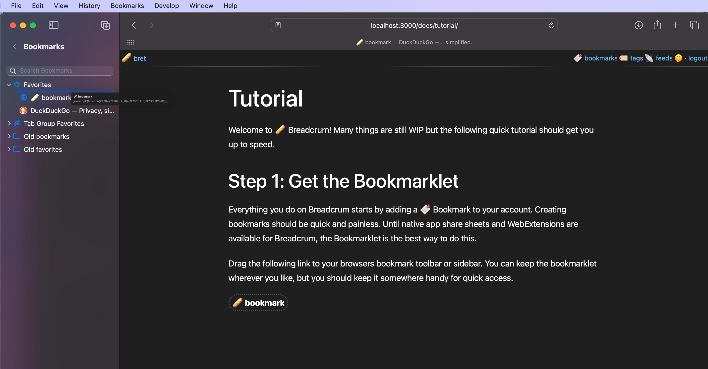
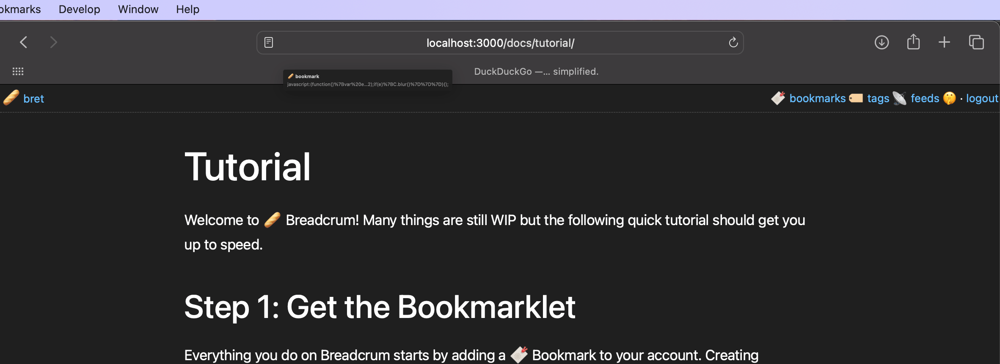
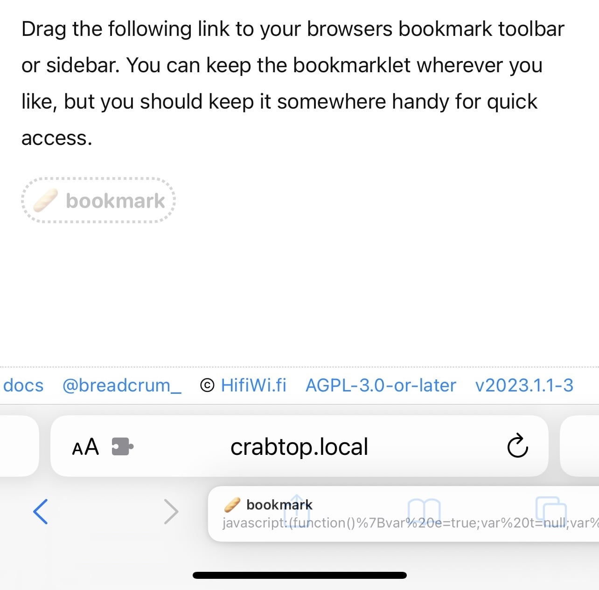
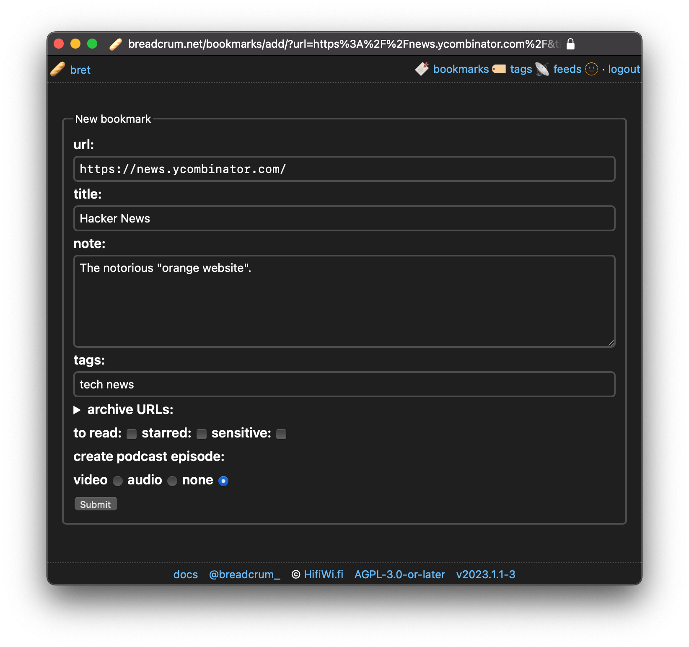
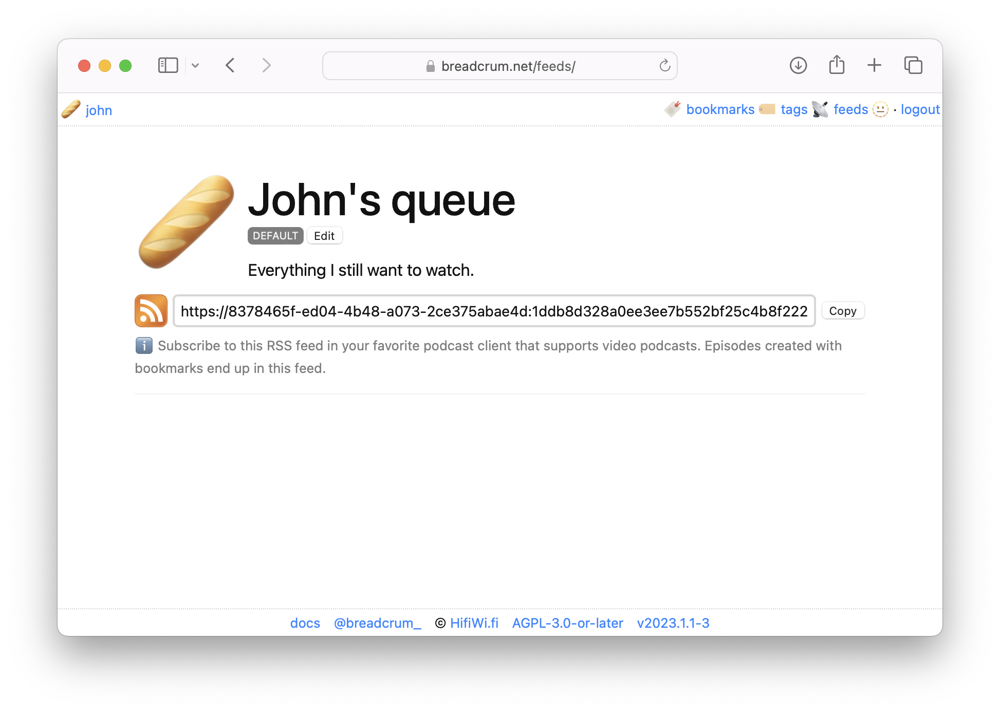
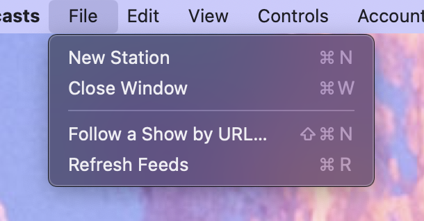
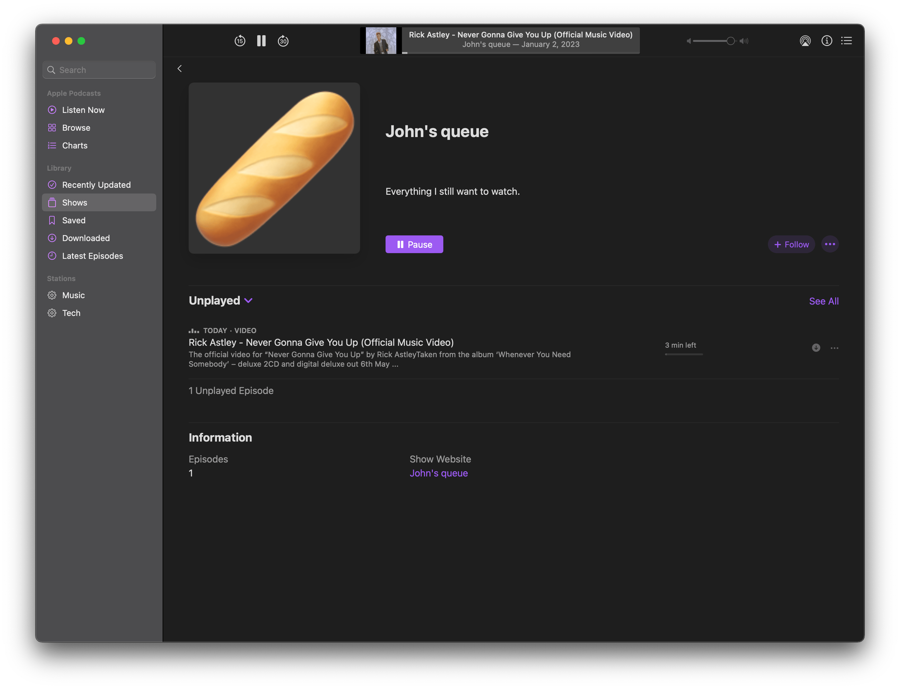

Welcome to 🥖 Breadcrum! Many things are still WIP but the following quick tutorial should get you up to speed.
For more detail, see the [docs index](/docs/).

## Step 1: Get the Bookmarklet

Everything you do on Breadcrum starts by adding a 🔖 Bookmark to your account.
Creating bookmarks should be quick and painless.
Until native app share sheets and WebExtensions are available for Breadcrum, the Bookmarklet is the best way to do this.
Learn more in [Bookmarklets](/docs/bookmarks/bookmarklets/).
iOS users can use [Apple Shortcuts](/docs/bookmarks/apple-shortcuts/),
and advanced users can prefill bookmarks via the [Bookmark Add Page API](/docs/bookmarks/bookmark-add-page-api/).

Drag the following link to your browsers bookmark toolbar or sidebar.
You can keep the bookmarklet wherever you like, but you should keep it somewhere handy for quick access.

<a class="bc-bookmarklet" href="{{ vars.bookmarklet }}">🥖 bookmark</a>

This can be done in a number of different ways. Here are some examples

<figure>
  
  <figcaption>Use <kbd>cmd</kbd><kbd>shift</kbd><kbd>L</kbd> to show the Safari sidebar and drag the bookmarklet to the bookmark menu or favorite bar folder.</figcaption>
</figure>

<figure>
  
  <figcaption>Use <kbd>cmd</kbd><kbd>shift</kbd><kbd>B</kbd> to show the bookmark bar and drag the bookmarklet to the bookmark bar in safari. Use a similar procedure in other browsers.</figcaption>
</figure>

<figure>
  
  <figcaption>On iOS, drag the bookmarklet to the bookmark button until the bookmark menu opens up. Place it anywhere you like.</figcaption>
</figure>

Add the bookmarklet to all browsers you plan on using Breadcrum with. Using a cloud sync between devices can save you some extra work of adding it on more than one device.

## Step 2: Bookmark a Website

When on a website, click on the bookmarklet that you added to your browser bookmarks. This will open the add bookmark window.

<figure class="borderless">
  
  <figcaption>This window lets you create a new bookmark. You can add tags, a note, related archival links and even create podcast episodes from media found in the page.</figcaption>
</figure>

Fill in the details and click `Submit`.
See [Bookmarks](/docs/bookmarks/) for lifecycle details, flags, and archive/episode options.

## Step 2: View your 🔖 Bookmarks

Visit [🔖 Bookmarks](/bookmarks/) to view your bookmarks.
You can also explore [Starred](/docs/bookmarks/starred/),
[Read it later](/docs/bookmarks/toread/), and
[Private (Sensitive)](/docs/bookmarks/private/).

<figure class="borderless">
  <picture>
    <source srcset="/static/screenshots/bookmark-window-dark.png" media="(prefers-color-scheme: dark)" />
    
  </picture>
  <figcaption>This window lets you create a new bookmark. You can add tags, a note, related archival links and even create podcast episodes from media found in the page.</figcaption>
</figure>

## Step 3: Subscribe to your 📡 Feed

Visit [📡 Feeds](/feeds/) to get your private Breadcrum podcast feed URL.
Episodes are built from bookmarks, so it helps to skim [Episodes](/docs/episodes/) and
[Archives](/docs/archives/).

<figure class="borderless">
  <picture>
    <source srcset="./img/feed-dark.png" media="(prefers-color-scheme: dark)" />
    
  </picture>
  <figcaption>On the feed page, get your private podcast feed URL to subscribe to in a podcast app. Don't share this URL! It has a private token that makes it so only you can see the feed.</figcaption>
</figure>

Paste the feed URL into your favorite podcast app (that preferably supports video podcasts).

<figure>
  
  <figcaption>Follow the show in Apple Podcasts by going to the file Menu and selecting "Follow a Show by URL...".</figcaption>
</figure>

After a moment, your feed will refresh and download any content that you capture when creating bookmarks!

<figure class="borderless">
  
  <figcaption>All media from around the web, ready for you as a podcast.</figcaption>
</figure>

## Step 4: Play around!

Breadcrum has many features that will be documented soon! Follow [@breadcrum_](https://x.com/breadcrum_) for updates as they are available.
Manage login and security from [Account settings](/docs/account/).
