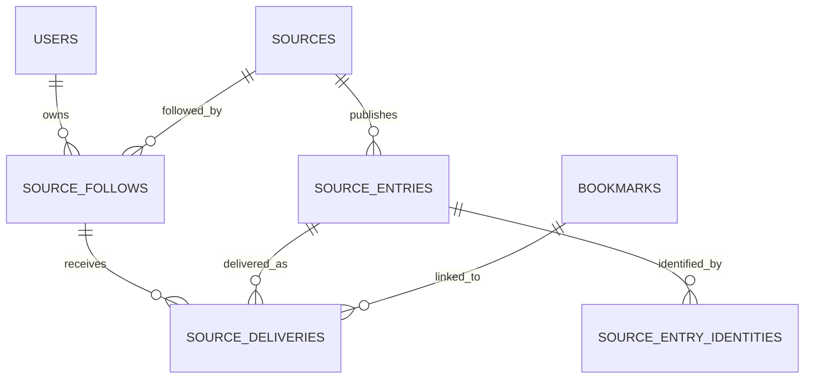
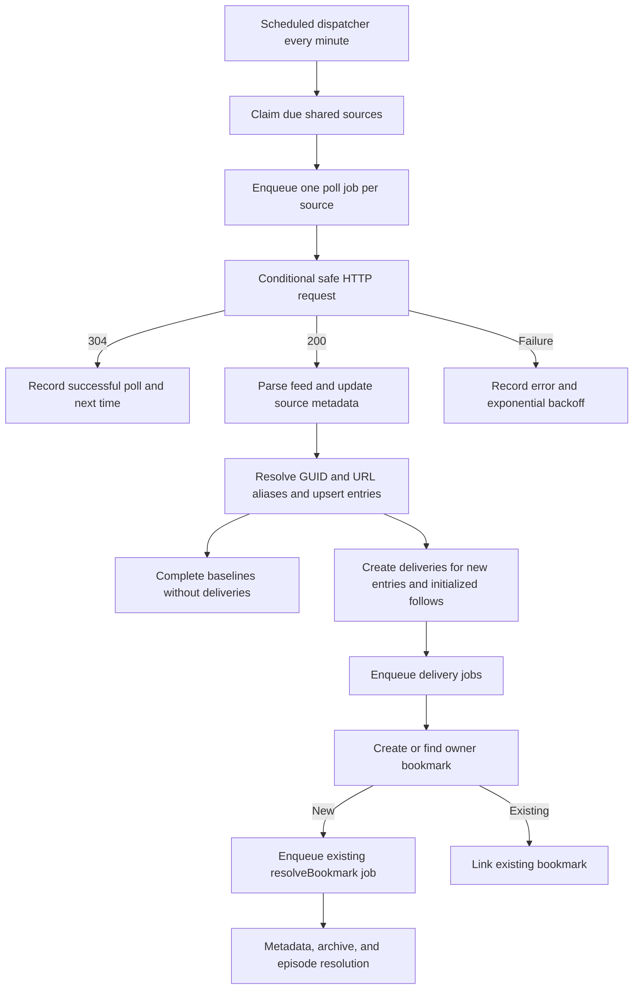

# Plan: Following Sources

## Objective

Add a user-facing feature named **Following**.
Users can follow a limited number of public RSS or Atom sources.
Breadcrum periodically polls each source and automatically creates bookmarks for newly discovered posts.
Bookmarks created through Following enter the existing bookmark resolution pipeline with metadata, archive, and episode resolution enabled.
The feature includes direct-feed validation, HTML feed autodiscovery, and first-class YouTube channel and playlist discovery.

## Product Decisions

- The user-facing feature name is **Following**.
- The API and domain resource name is **Sources**.
- The word **subscription** is reserved for billing and paid account plans.
- Existing `/feeds/` and `/api/feeds` remain the generated podcast-feed feature and are not reused for incoming feeds.
- Version one supports public HTTP and HTTPS RSS 2.0 and Atom 1.0 sources.
- JSON Feed, authenticated feeds, OPML import/export, per-follow tags, and custom polling intervals are follow-up work.
- The default per-user limit is 10 followed sources and is configurable by the deployment.
- Existing posts are not imported when a source is followed or re-enabled.
- The first successful poll establishes a baseline, and only entries first seen on later polls create bookmarks.
- If an entry URL is already bookmarked by the user, the follow relationship records the existing bookmark and does not create another archive or episode.
- Unfollowing a source does not delete bookmarks, archives, or episodes that Following previously created.
- Pausing and resuming a followed source establishes a new baseline so posts published while paused are not backfilled.
- Feed entries without a usable public HTTP or HTTPS URL are ignored and counted for diagnostics because Breadcrum cannot create a bookmark for them.
- Publication dates are untrusted metadata and never determine whether an entry is new.
- Missing, invalid, non-positive, or future publication dates are replaced with the poll observation time.
- RSS GUIDs and Atom IDs are opaque strings rather than assumed UUIDs, and no single feed-provided identifier is trusted as the only deduplication key.
- Repeated identifiers, identifier changes, and URL changes cannot overwrite another entry, cause redelivery, or create an unbounded amount of work.
- Per-response, per-poll, and rolling delivery budgets contain feeds that churn identifiers or publish excessive entries.
- Raw feed HTML is not rendered or copied into bookmarks in version one.

## Existing Architecture Findings

### Generated feeds and followed sources are different domains

`packages/web/migrations/003.do.add-podcast-anything.sql` defines `podcast_feeds` as Breadcrum-generated output feeds containing episodes.
`packages/web/routes/api/feeds/` and `packages/web/client/feeds/` manage those generated feeds.
Incoming sources need separate tables, routes, schemas, UI, and terminology to avoid overloading the existing feed model.

### Bookmark creation already provides the desired downstream behavior

`packages/web/routes/api/bookmarks/put-bookmarks.js` normalizes and deduplicates a URL, creates a bookmark, and submits a `resolveBookmark` job.
`packages/worker/workers/bookmarks/index.js` resolves metadata and can create and finalize archives and episodes.
`packages/resources/bookmarks/resolve-bookmark-queue.js` defines the shared queue contract used by the web and worker processes.
Source delivery should create or find a bookmark and enqueue this existing pipeline with `resolveBookmark`, `resolveArchive`, and `resolveEpisode` set to `true`.
Following code should not duplicate the archive and episode extraction logic.

### Shared bookmark creation needs a small refactor

The reusable bookmark insert currently lives in `packages/web/routes/api/bookmarks/put-bookmark-query.js`, while the worker cannot depend on the web package.
Move or extract the database-level create-or-find operation into `packages/resources/bookmarks/` and keep HTTP response shaping, metrics, and route behavior in the web route.
The shared operation must remain owner-scoped and rely on the existing `unique (owner_id, url)` constraint.
Feed entry URL normalization should call `normalizeURL()` with shortener expansion disabled so polling does not perform unrelated network requests inside a database transaction.
Feed source URL canonicalization must be a separate helper because stripping query parameters or applying bookmark-specific host rewrites can break feed URLs.

### Polling is naturally implemented with pg-boss

`packages/worker/plugins/pgboss.js` creates typed queues, registers workers, and schedules recurring jobs.
A single recurring dispatcher should find due sources instead of creating one cron schedule per followed source.
The dispatcher should claim due rows with `for update skip locked`, advance a short dispatch lease, and enqueue one source-poll job per row.
Per-source and per-entry database identities must make polling and delivery safe under at-least-once queue execution.

### Account limits have an existing configuration precedent

`PASSKEY_MAX_PER_USER` in `packages/web/plugins/auth.js` is the existing environment-backed per-user resource limit.
Creating a follow relationship should use a similar validated setting but enforce it transactionally to prevent concurrent requests from exceeding the limit.
The API should return effective usage and limit values so the client never hardcodes the deployment limit.

### URL safety exists but needs a polling-grade fetch wrapper

`packages/resources/urls/ssrf-check.js` rejects non-HTTP protocols and private, loopback, link-local, multicast, reserved, and cloud-metadata addresses.
`packages/resources/bookmarks/normalize-url.js` rechecks redirect targets while expanding known shorteners.
Following amplifies user-controlled fetching indefinitely, so every discovery and poll request needs redirect-by-redirect checks, strict timeouts, decompressed response-size limits, and no ambient cookies or credentials.
A new shared safe-fetch helper should pin or otherwise bind requests to validated DNS results where possible instead of validating one resolution and allowing the HTTP client to resolve the host independently.

## Feedbin Research

This plan was compared against [Feedbin](https://github.com/feedbin/feedbin) at commit [`1cc1568670936e9513ccc417bea546503bbe278b`](https://github.com/feedbin/feedbin/tree/1cc1568670936e9513ccc417bea546503bbe278b) and its parser/fetch library [Feedkit](https://github.com/feedbin/feedkit) at commit [`74dcbde9214c710bddb20bee88b3b9ecde9b90df`](https://github.com/feedbin/feedkit/tree/74dcbde9214c710bddb20bee88b3b9ecde9b90df).
The research is a source of operational patterns rather than a recommendation to copy Feedbin's implementation or security assumptions verbatim.

### Patterns to adopt

[Feedbin's entry filter](https://github.com/feedbin/feedbin/blob/1cc1568670936e9513ccc417bea546503bbe278b/app/jobs/feed_crawler/lib/entry_filter.rb) processes at most the first 300 parsed entries, separating new, updated, and unchanged items before persistence.
Breadcrum should use the same kind of hard per-document entry cap and add lower delivery budgets because each delivered entry triggers expensive bookmark, archive, and media work.

[Feedbin's entry model](https://github.com/feedbin/feedbin/blob/1cc1568670936e9513ccc417bea546503bbe278b/app/models/entry.rb) replaces missing, future, and non-positive publication dates with `Time.now` in `ensure_published`.
Breadcrum should likewise normalize untrusted dates to observation time and must never use a feed date as the new-entry boundary.

[Feedkit's entry identity code](https://github.com/feedbin/feedkit/blob/74dcbde9214c710bddb20bee88b3b9ecde9b90df/lib/feedkit/parser/entry.rb) hashes the feed URL together with an entry ID and falls back to URL, publication time, and title when an ID is absent.
It also creates an alternate identity for HTTP and HTTPS variants of URL-shaped IDs.
Breadcrum should adopt source-scoped hashed identities and alternate aliases, but should avoid publication time and title in fallback identities because hostile or buggy feeds can change them on every poll.

[Feedbin's receiver](https://github.com/feedbin/feedbin/blob/1cc1568670936e9513ccc417bea546503bbe278b/app/jobs/feed_crawler/receiver.rb) checks primary and alternate IDs, relies on a unique database index, ignores race-lost `RecordNotUnique` inserts, and treats a matching ID as an update rather than a new entry.
Breadcrum should similarly make the database authoritative and resolve both GUID and canonical-URL aliases before inserting an entry.

[Feedbin's entry-update path](https://github.com/feedbin/feedbin/blob/1cc1568670936e9513ccc417bea546503bbe278b/app/jobs/feed_crawler/lib/entry_update.rb) updates author, content, title, URL, entry ID, data, and fingerprint but intentionally does not update the original publication timestamp.
Breadcrum should keep `first_seen_at`, normalized publication time, delivery state, and resolved identity immutable after insertion.

[Feedbin's downloader](https://github.com/feedbin/feedbin/blob/1cc1568670936e9513ccc417bea546503bbe278b/app/jobs/feed_crawler/downloader.rb) uses conditional HTTP validators, checks a content fingerprint even after a successful response, records redirect state, and applies persistent retry state.
[Feedkit's request implementation](https://github.com/feedbin/feedkit/blob/74dcbde9214c710bddb20bee88b3b9ecde9b90df/lib/feedkit/request.rb) streams to a temporary file, limits responses to 10 MiB, caps redirects, and applies connect, write, and read timeouts.
Breadcrum should adopt conditional requests, streaming limits, redirect caps, timeouts, response fingerprints, and durable backoff while using a smaller default response limit for the narrower version-one feature.

[Feedbin's content formatter](https://github.com/feedbin/feedbin/blob/1cc1568670936e9513ccc417bea546503bbe278b/app/models/content_formatter.rb) parses untrusted HTML through Loofah, prunes dangerous elements, restricts URL protocols, strips arbitrary style and class attributes, and optionally proxies images.
Breadcrum version one should avoid rendering feed HTML entirely, derive only bounded plain-text title and summary values, and continue fetching the entry page through the existing archive pipeline.
If raw feed content is rendered later, it needs an equivalent allowlist sanitizer, URL rebasing, remote-image proxying, and malformed-tree fallback.

### Improvements over the observed behavior

Feedkit removes duplicate primary IDs within one parsed document by keeping the first item with each generated `public_id`.
Breadcrum should pre-scan repeated GUIDs and distinguish exact duplicates from conflicting entries instead of making document order decide which post owns an identifier.

Feedbin generally interprets a reused primary ID as an update to the existing entry.
Breadcrum should refuse identity-changing updates when the same GUID appears with a different canonical URL and should fall back to URL identity for the conflicting item.
This prevents a malicious or broken feed from repeatedly overwriting one trusted entry or hiding all future posts behind one reused GUID.

The inspected Feedkit request code supports feed credentials and disables TLS certificate verification in its custom SSL context.
Breadcrum version one explicitly rejects feed credentials and must retain normal TLS certificate and hostname verification.
Feedbin's network architecture may apply protections outside these files, so absence from the inspected code should not be treated as proof that the deployed service lacks them.

## Recommended Data Model

Use globally shared source and entry rows so a popular feed such as a YouTube channel is fetched and parsed once per interval, regardless of how many users follow it.
Keep user ownership, limits, enablement, baselining, and delivery history in separate `source_follows` rows.
Only public feeds are supported in version one, which keeps shared polling compatible with the product contract.

### `sources`

This table represents one canonical external feed and owns shared polling state.

Recommended columns are:

- `id uuid primary key default gen_random_uuid()`.
- `feed_url text not null unique` for the final canonical feed URL.
- `site_url text` for the source website or channel page.
- `title text` with the existing 255-character title convention.
- `description text`.
- `format text` constrained to supported parser formats such as `rss` and `atom`.
- `etag text` preserving the exact HTTP validator value.
- `last_modified text` preserving the exact HTTP validator value.
- `last_polled_at timestamptz`.
- `last_success_at timestamptz`.
- `next_poll_at timestamptz not null default now()`.
- `consecutive_failures bigint not null default 0`.
- `last_error text`.
- `disabled boolean not null default false` for operator-controlled terminal blocking.
- `quarantined_until timestamptz` for an automatic anomaly circuit breaker.
- `last_warning text` for bounded parser and identity anomaly reporting.
- `consecutive_anomalous_polls bigint not null default 0`.
- `created_at timestamptz not null default now()`.
- `updated_at timestamptz not null default now()`.

Add a partial index on `(next_poll_at, id)` where `disabled = false`.
The due-source query must also require at least one enabled follow relationship and `quarantined_until is null or quarantined_until <= now()`.
Normalize source titles and descriptions to bounded plain text using the same control-character and Unicode rules as entries.
Do not persist or render source-level HTML.
Add the standard update timestamp trigger and comments for the table and every column.

### `source_follows`

This table is the user-owned relationship to a shared source.

Recommended columns are:

- `id uuid primary key default gen_random_uuid()`.
- `owner_id uuid not null references users(id) on delete cascade`.
- `source_id uuid not null references sources(id) on delete cascade`.
- `enabled boolean not null default true`.
- `baseline_completed_at timestamptz`.
- `created_at timestamptz not null default now()`.
- `updated_at timestamptz not null default now()`.

Add `unique (owner_id, source_id)`.
Add owner and source indexes.
Set `baseline_completed_at` to null when a paused source is resumed.
Add the standard update timestamp trigger and complete comments.

### `source_entries`

This table stores each logical source entry once and provides feed-level idempotency.

Recommended columns are:

- `id uuid primary key default gen_random_uuid()`.
- `source_id uuid not null references sources(id) on delete cascade`.
- `url text not null` containing the validated canonical entry URL.
- `reported_id text` containing a trimmed and length-limited RSS GUID or Atom ID for diagnostics only.
- `title text` containing bounded plain text.
- `summary text` containing bounded plain text rather than feed HTML.
- `author_name text` containing bounded plain text.
- `reported_published_time timestamptz` containing a valid in-range feed date when one was supplied.
- `published_time timestamptz not null` containing the safe normalized date used by Breadcrum.
- `published_time_source text not null` constrained to `feed` or `observed`.
- `content_fingerprint text not null` for detecting metadata changes without affecting identity.
- `first_seen_at timestamptz not null default now()`.
- `last_seen_at timestamptz not null default now()`.
- `created_at timestamptz not null default now()`.
- `updated_at timestamptz not null default now()`.

Add an index on `(source_id, published_time desc, id desc)`.
Keep `first_seen_at`, `published_time`, and `published_time_source` immutable after insertion.
Update bounded title, summary, author, fingerprint, and `last_seen_at` only after identity resolution succeeds.
Never change an existing entry's URL merely because a reused GUID arrived with a different URL.
Skip entries without a usable public HTTP or HTTPS URL because they cannot become bookmarks.

### `source_entry_identities`

This table gives one logical entry multiple source-scoped aliases without trusting any one feed field.

Recommended columns are:

- `source_id uuid not null references sources(id) on delete cascade`.
- `source_entry_id uuid not null references source_entries(id) on delete cascade`.
- `kind text not null` constrained to `guid` or `url`.
- `value_hash text not null` containing a SHA-256 digest of a versioned, length-delimited canonical identity value.
- `created_at timestamptz not null default now()`.

Use `(source_id, kind, value_hash)` as the primary key.
Add an index on `source_entry_id` for cascade and reverse lookup efficiency.
Hash canonical values so unbounded or hostile identifiers are not used directly as index keys.
Store a bounded `reported_id` on the entry only for diagnostics and never include it in logs without escaping.
The URL alias is always present, and the GUID alias is added only when it is non-empty and non-conflicting.

Resolve one poll as a batch before writing entries:

1. Trim and length-limit every GUID or Atom ID, canonicalize every entry URL, and compute URL aliases.
2. Group entries by canonical URL and collapse exact repeats before any insert.
3. Treat one canonical URL with divergent entry metadata as an ambiguous URL group, preserve any existing entry, and skip a new ambiguous group rather than letting document order choose its metadata.
4. Group non-empty reported IDs and classify one ID attached to multiple canonical URLs as a GUID conflict.
5. Resolve existing URL aliases first so a changed GUID cannot create a duplicate entry for the same URL.
6. Resolve a non-conflicting GUID alias second only when its previously associated canonical URL matches the current canonical URL.
7. For a missing or conflicting GUID, use only the URL alias.
8. If an existing GUID resolves to an entry with a different canonical URL and no matching URL alias exists, preserve the existing entry and create or resolve the new entry by URL without attaching the conflicting GUID.
9. Insert entries and aliases with conflict-safe SQL and re-read the winning rows after races.
10. Treat metadata changes as updates only and never create a second delivery for an existing logical entry.

This policy handles missing IDs, repeated IDs, canonical-equivalent HTTP-to-HTTPS representations, changed IDs for one URL, GUID reuse across different URLs, and concurrent poll retries.
It deliberately favors duplicate suppression and immutable history over allowing a feed to rewrite an existing delivered entry.

### `source_deliveries`

This table provides per-user idempotency and links a source entry to its bookmark result.

Recommended columns are:

- `source_follow_id uuid not null references source_follows(id) on delete cascade`.
- `source_entry_id uuid not null references source_entries(id) on delete cascade`.
- `bookmark_id uuid references bookmarks(id) on delete set null`.
- `status text not null` constrained to `pending`, `bookmarked`, `existing_bookmark`, `suppressed`, and `failed`.
- `error text`.
- `enqueued_at timestamptz`.
- `processed_at timestamptz`.
- `created_at timestamptz not null default now()`.
- `updated_at timestamptz not null default now()`.

Use `(source_follow_id, source_entry_id)` as the primary key.
Use `on delete set null` for bookmarks so deleting a bookmark does not erase delivery history and recreate the same post on a later poll.
Add an index for pending delivery work and the standard update timestamp trigger.

### Orphan cleanup

Deleting a user cascades through `source_follows` and deliveries but intentionally leaves shared sources used by other users intact.
Add a scheduled cleanup that removes sources with no follow relationships after a short retention period.
Deleting an orphan source then cascades through its entries.
Do not prune individual entries or aliases in version one because deleting an old identity can cause a reappearing feed item to be delivered again.

## Feed Discovery

Add shared discovery code under `packages/resources/sources/` so the web API and worker use exactly the same URL and parser rules.
Do not hand-roll RSS or Atom parsing with DOM selectors.
Evaluate and pin a maintained parser with RSS 2.0 and Atom 1.0 support, safe XML defaults, ESM compatibility, and usable types, with `feedsmith` as the initial candidate for a fixture spike.
Do not enable external XML entities or network resolution from XML documents.

Discovery should run in this order:

1. Parse the submitted value and reject credentials, fragments, unsupported protocols, and unsafe hosts.
2. Apply feed-specific URL canonicalization that lowercases the scheme and host and removes only default ports and fragments.
3. Recognize direct YouTube channel and playlist URL shapes before the generic request.
4. Fetch the URL with the shared safe-fetch helper and an `Accept` header covering RSS, Atom, XML, and HTML.
5. If the response parses as RSS or Atom, return the final response URL as a candidate.
6. If the response is HTML, parse `<link rel="alternate">` entries with `application/rss+xml` or `application/atom+xml`, resolve relative links, and validate every candidate.
7. If generic HTML discovery finds nothing, run provider-specific adapters.
8. Return all valid candidates with title, feed URL, site URL, and format so the user can choose when a page exposes multiple feeds.

### YouTube support

Support direct YouTube feed URLs without modification.
Recognize `/channel/:channelId` and construct `https://www.youtube.com/feeds/videos.xml?channel_id=:channelId`.
Recognize playlist URLs with a valid `list` value and construct `https://www.youtube.com/feeds/videos.xml?playlist_id=:playlistId`.
For `/@handle`, `/user/`, and custom channel URLs, prefer YouTube's HTML RSS alternate link and canonical channel metadata over brittle embedded application-state scraping.
Validate the constructed or discovered URL by fetching and parsing its Atom response before presenting it as subscribable.
Keep provider behavior behind a small adapter interface so service-specific discovery can be added without changing generic discovery.

### Safe fetch requirements

- Permit only public HTTP and HTTPS destinations.
- Reject URLs containing username or password credentials.
- Validate every redirect target before following it.
- Limit redirects to five.
- Apply separate header and body deadlines.
- Cap the decompressed response body, with a proposed default of 2 MiB.
- Send a stable Breadcrum feed-poller user agent and an operator contact URL.
- Never send user cookies, authorization headers, or browser session state.
- Respect `Retry-After` for `429` and `503` responses.
- Bound per-host and global concurrency so one provider cannot exhaust the worker.
- Treat unsupported content types as errors unless the body safely parses as a supported feed.
- Record the final URL only after all redirect and content validation succeeds.
- Keep normal TLS certificate and hostname verification enabled.
- Compute a bounded response fingerprint so a `200` response with unchanged bytes can skip parsing like a conditional `304`.

### Untrusted feed normalization

Treat the parser output as untrusted structured input rather than as a valid domain object.
Normalize and validate every field after parsing and before beginning a database transaction.

- Process at most 300 entries from one response, matching Feedbin's defensive parse cap.
- Persist at most 100 newly identified source entries from one poll.
- Create at most 25 new deliveries for one follow relationship from one poll.
- Create at most 100 automatic bookmarks for one followed source in a rolling 24-hour window.
- Make all four limits configurable with conservative maximums.
- Mark over-budget delivery candidates as `suppressed` rather than deferring a future burst.
- Count and report truncated, suppressed, malformed, and conflicting items without logging raw content.
- Limit reported IDs and URLs to 2,048 characters before canonicalization or hashing.
- Limit title and author fields to 255 Unicode code points.
- Limit plain-text summaries to 10,000 Unicode code points.
- Remove null bytes and disallowed control characters before persistence.
- Normalize text to a consistent Unicode normalization form before hashing or comparison.
- Do not persist raw XML, raw feed HTML, arbitrary extension objects, or unknown parser fields in version one.
- Do not fetch feed-provided images, enclosures, stylesheets, scripts, or linked resources during parsing.

Use one `observed_at` timestamp captured at the start of a successful poll for all entries in that response.
Parse publication dates with explicit failure handling and reject values outside JavaScript's safe date range before constructing database values.
If a publication date is missing, invalid, non-positive, or later than `observed_at` plus five minutes of clock tolerance, set `published_time = observed_at` and `published_time_source = 'observed'`.
Otherwise preserve it as both `reported_published_time` and `published_time` with `published_time_source = 'feed'`.
Never update normalized publication time after insertion, and never schedule or delay a bookmark based on a feed publication date.

A poll with some malformed entries can succeed using its valid entries.
A poll with no structurally valid feed, no usable entries during initial validation, or a parser resource-limit violation fails without modifying entry or baseline state.
Repeated anomalous polls that exceed configured conflict or churn thresholds should set `quarantined_until` with bounded backoff rather than continuing to generate work every 15 minutes.
A quarantined source remains visible to followers with its warning and is retried after the quarantine interval rather than permanently disabled.

## API Plan

Use a dedicated top-level source resource because Following is a primary user feature alongside bookmarks, tags, and generated feeds.
Use auth-token CRUD as the implementation reference rather than the older generated-feed CRUD.
Every mutation requires `verifyJWT` and `notDisabled`, and every item query includes both the item ID and authenticated owner ID.

### Routes

- `POST /api/sources/discover` validates an entered page or feed URL and returns feed candidates.
- `GET /api/sources` returns the user's followed sources, polling state, and usage metadata.
- `POST /api/sources` follows a selected feed source and returns `201`.
- `GET /api/sources/:id` returns one owner-scoped followed source.
- `PUT /api/sources/:id` pauses or resumes a followed source.
- `DELETE /api/sources/:id` unfollows the source and returns `204`.

A manual poll endpoint is intentionally deferred until automatic polling is stable.
If it is added later, it needs strict per-user rate limiting and should only move `next_poll_at` forward rather than bypassing queue deduplication.

### Limit enforcement

Add `SOURCES_MAX_PER_USER` with a default of 10, a minimum of 1, and a conservative deployment maximum.
During creation, begin a transaction, lock the authenticated `users` row, count that owner's `source_follows`, enforce the cap, and insert the relationship before committing.
The unique owner/source constraint independently prevents following the same source twice.
Return `409 Conflict` with a stable error code and the effective limit when the cap or duplicate constraint is reached.
Return list metadata shaped like `{ count, limit }` so the UI can display `Following 3 of 10 sources` without duplicating configuration.
Apply a modest route-level rate limit to discovery and creation because both can lead to external network work.

### Schemas

Create reusable base, create, update, read, discovery-candidate, and list-response schemas under `packages/web/routes/api/sources/schemas/`.
Export `FromSchema` types from schema files and use required nullable fields for operational values such as `last_polled_at`, `last_success_at`, and `last_error`.
Expose source and follow status through the followed-source read model but do not expose HTTP validators or internal scheduling leases to the client.
Use explicit `reply.code(...).send(...)` responses.

## Polling and Delivery Flow

### Dispatcher

Create a scheduled dispatcher queue that runs every minute in `packages/worker/plugins/pgboss.js`.
The dispatcher selects a bounded batch ordered by `next_poll_at, id` using `for update skip locked`.
Only sources with at least one enabled follow relationship and no active quarantine are eligible.
Advance `next_poll_at` to a short lease before enqueueing so multiple worker instances cannot dispatch the same source concurrently.
Use a deterministic pg-boss job key based on the source ID where supported by the installed pg-boss version.
Reload source state inside the poll worker instead of placing URLs or validators permanently in job payloads.

### Source polling

Send `If-None-Match` and `If-Modified-Since` when validators exist.
Treat `304 Not Modified` as a successful poll that clears failure state.
On `200`, normalize source metadata, parse at most the configured entry cap, pre-scan identity conflicts, and resolve entries through GUID and URL aliases.
Apply all field, date, source-entry, delivery, and rolling automatic-bookmark budgets before enqueueing work.
On an ordinary success, set `last_polled_at` and `last_success_at`, clear `last_error`, reset `consecutive_failures`, and schedule the next poll with jitter.
On a success containing bounded anomalies, also update `last_warning` and `consecutive_anomalous_polls` without allowing raw feed values into logs.
Reset anomaly state and clear an expired `quarantined_until` after a clean poll.
Start with a 15-minute minimum successful interval and make the deployment default configurable.
Feed-provided cache hints may lengthen the interval but must not shorten it below the configured minimum.
On failure, update `last_polled_at`, increment `consecutive_failures`, store a concise error, and apply bounded exponential backoff up to 24 hours.
Honor a valid `Retry-After` value when it requests a longer delay.
Do not automatically disable a source for ordinary HTTP or parser failures.
Temporarily quarantine sources that repeatedly exceed identity-conflict, entry-churn, or delivery-budget thresholds.

### Baseline semantics

Poll and entry fan-out should be committed transactionally.
For `source_follows` whose `baseline_completed_at` is null, upsert the currently visible source entries but create no delivery rows.
Set those follow relationships' `baseline_completed_at` only after the feed was parsed successfully.
For already initialized and enabled follow relationships, create delivery rows only for logical source entries inserted by the current poll and admitted by the delivery budget.
Create `suppressed` delivery rows for over-budget entries so they cannot be replayed as a future backlog.
This rule uses first observation and resolved identity rather than unreliable publication timestamps to decide whether a post is new.

### Delivery processing

Create a dedicated delivery queue so a popular source cannot create an unbounded amount of bookmark work inside one poll transaction.
A delivery worker loads the follow relationship, entry, and owner state from PostgreSQL.
If the follow relationship is missing or paused, or it is already over its rolling automatic-bookmark budget, suppress the delivery without creating a bookmark.
Normalize the entry URL without network-based shortener expansion.
In one transaction, insert or find the owner bookmark and attach its ID to the delivery.
If the bookmark already existed, mark the delivery `existing_bookmark` and stop.
If the bookmark is new, mark the delivery `bookmarked`, commit it, and enqueue `resolveBookmark` with all three resolution flags enabled.
Use the feed title and summary as initial bookmark metadata when present, while allowing the normal resolver to fill missing values.
Use a deterministic pg-boss job key derived from the delivery ID to prevent duplicate resolution jobs during retries or crash recovery.
Record `enqueued_at` only after queue submission succeeds.
Add a reconciliation path for new-bookmark deliveries with a null `enqueued_at` so a process crash between commit and queue submission does not permanently lose archive and episode work.

## Queue and File Layout

Recommended shared modules are:

- `packages/resources/sources/discover-feed.js`.
- `packages/resources/sources/feed-url.js`.
- `packages/resources/sources/parse-feed.js`.
- `packages/resources/sources/normalize-feed-entry.js`.
- `packages/resources/sources/resolve-entry-identities.js`.
- `packages/resources/sources/safe-fetch.js`.
- `packages/resources/sources/dispatch-source-polls-queue.js`.
- `packages/resources/sources/poll-source-queue.js`.
- `packages/resources/sources/process-source-delivery-queue.js`.
- `packages/resources/bookmarks/create-or-get-bookmark.js`.

Recommended worker modules are:

- `packages/worker/workers/sources/dispatch-source-polls.js`.
- `packages/worker/workers/sources/poll-source.js`.
- `packages/worker/workers/sources/process-source-delivery.js`.
- `packages/worker/workers/sources/cleanup-orphan-sources.js`.

Register queue creation, schedules, worker concurrency, and lifecycle management in `packages/worker/plugins/pgboss.js`.
Add source worker concurrency, polling cadence, batch size, request timeout, response size, entry count, delivery count, rolling bookmark budget, and quarantine settings through a worker environment-schema fragment.

## UI Plan

Add a dedicated authenticated `/following/` page with `client.js`, `page.js`, `page.vars.js`, `style.css`, and focused tests.
Add a **following** header link next to bookmarks, tags, and generated feeds so the distinction remains visible.
Optionally gate the navigation and page behind a frontend `following` rollout flag, while independently enforcing rollout state on the API.

The page should provide:

- A URL field labeled for a website, YouTube channel or playlist, RSS URL, or Atom URL.
- A **Discover feeds** action.
- A candidate chooser when discovery returns more than one feed.
- A **Follow source** confirmation action rather than creating a relationship during discovery.
- A usage indicator sourced from API metadata.
- A list showing title, site URL, feed URL, enabled state, last successful poll, next poll, and the latest error.
- Pause or resume controls.
- A two-step unfollow confirmation.
- Pending and first-poll states that explain that existing posts will not be imported.
- An empty state with examples for a normal website and a YouTube channel.

All browser files must include `/// <reference lib="dom" />`.
Use capitalized Preact components and mount them through HTM syntax or `tc()` rather than direct function calls.
Use typed form element access, `AbortController` cleanup, and server-provided error messages and limits.

## Observability

Add worker metrics for dispatch runs, due sources, poll duration, response status class, parsed entries, truncated entries, invalid dates, missing IDs, GUID conflicts, URL conflicts, new entries, metadata updates, suppressed deliveries, quarantines, baseline completions, delivery creation, delivery failure, and bookmark creation versus reuse.
Include source ID, `source_follow_id`, delivery ID, and job ID in structured logs without logging full feed URLs that may contain opaque tokens.
Expose queue depth through the existing generic pg-boss queue metrics.
Add an admin query or dashboard view for sources with high consecutive failure counts, anomaly counts, active quarantines, and suppression rates before adding automated operator disabling.

## Testing Plan

### Parser and discovery fixtures

- RSS 2.0 with GUIDs, relative URLs, dates, and missing optional metadata.
- Atom 1.0 matching a representative YouTube channel feed.
- YouTube channel ID, handle, custom channel, and playlist discovery.
- HTML with zero, one, and multiple alternate feed links.
- Redirected direct feeds and relative alternate links.
- Malformed XML, unsupported XML, external entity declarations, deeply nested input, and oversized decompressed responses.
- Missing, malformed, non-positive, extremely old, slightly future, and far-future publication dates.
- Exact duplicate entries with the same GUID and URL.
- One GUID repeated across multiple different URLs in one response, with input order reversed in a second test.
- One URL repeated under multiple GUIDs.
- A changed GUID for an existing URL.
- A changed URL under a stable non-conflicting GUID.
- A historical GUID reused later for a different URL.
- Missing GUIDs with stable URLs and entries with neither a GUID nor a usable URL.
- HTTP and HTTPS variants of URL-shaped identifiers.
- Oversized identifiers, URLs, titles, authors, summaries, extension objects, and entry counts.
- Feed HTML containing scripts, event handlers, styles, iframes, tracking images, and unsafe URL protocols.

### Safe fetch

- Non-HTTP protocols and URLs with credentials.
- Loopback, private, link-local, carrier-grade NAT, multicast, reserved, and cloud-metadata destinations.
- Public URL redirects to private destinations.
- Redirect loops and redirect limits.
- Header timeout, body timeout, compressed-size expansion, and body-size limits.
- Conditional request headers and `304` handling.
- `429`, `503`, and `Retry-After` behavior.

### API

- Authentication and disabled-user enforcement.
- Owner isolation for read, update, and delete operations.
- Schema validation and extra-property rejection.
- Successful discovery and candidate selection.
- Duplicate canonical source handling.
- The same shared source followed by different users.
- Transactional per-user limit enforcement, including concurrent create requests.
- Configurable limit metadata.
- Follow, pause, resume, and unfollow behavior.
- User deletion cascade without deleting a source still used by another user.

### Workers

- Multiple dispatcher instances do not claim the same source.
- Repeated poll jobs converge on one set of entries, aliases, and deliveries.
- Initial polls baseline without creating bookmarks.
- Later polls deliver only newly inserted logical entries.
- Publication dates never determine newness or delay delivery.
- Entry metadata updates never mutate first-seen or normalized publication times and never create a new delivery.
- Repeated or conflicting GUIDs cannot overwrite another entry's URL or metadata.
- URL aliases prevent a changed GUID from creating a duplicate entry.
- Feed URL canonicalization prevents harmless URL-representation changes from creating a duplicate entry.
- A stable GUID presented with a genuinely different canonical URL is treated as a conflict rather than permission to overwrite the original entry.
- Per-response, per-poll, and rolling budgets create deterministic suppression rows rather than a deferred backlog.
- Repeated identity churn triggers temporary quarantine and a clean later poll clears anomaly state.
- Paused follow relationships receive no deliveries.
- Resumed follows skip entries observed while paused.
- The same entry is delivered independently to multiple followers.
- Existing bookmarks are linked without duplicate archive or episode creation.
- New bookmarks enqueue one resolution job with metadata, archive, and episode flags enabled.
- Queue-send failure is recovered by reconciliation.
- Successful conditional polls clear prior failure state.
- Failures update error state and bounded backoff.
- Orphan cleanup preserves shared sources that still have followers.

### UI

- Render, loading, empty, discovery, multiple-candidate, pending, error, limit-reached, disabled, and delete-confirmation states.
- Verify the page uses the effective API limit rather than a hardcoded number.
- Verify components are mounted through HTM and browser files include the DOM reference pragma.

## Implementation Phases

### Phase 1: Shared primitives and migration

1. Add the parser dependency after the fixture spike.
2. Implement feed-specific URL canonicalization, safe fetch, RSS and Atom parsing, generic autodiscovery, and YouTube adapters in `@breadcrum/resources`.
3. Add migration and undo migration files for `sources`, `source_follows`, `source_entries`, `source_entry_identities`, and `source_deliveries`.
4. Extract a worker-usable create-or-find bookmark helper into `@breadcrum/resources` without changing existing bookmark API behavior.
5. Add focused resource tests and run diagnostics before unit tests.

### Phase 2: Sources API

1. Add schemas and authenticated CRUD routes under `/api/sources`.
2. Add discovery with route-level rate limiting.
3. Add transactional limit enforcement with a default of 10.
4. Return effective usage and operational source state.
5. Add API tests for authentication, ownership, discovery, duplicates, concurrency, limits, and cascades.

### Phase 3: Polling and delivery workers

1. Add typed dispatcher, source-poll, delivery, and orphan-cleanup queues.
2. Register schedules and configurable concurrency in the worker pg-boss plugin.
3. Implement conditional polling, date normalization, multi-alias identity resolution, baselining, bounded entry upserts, delivery suppression, anomaly quarantine, and failure backoff.
4. Integrate delivery with shared bookmark creation and the existing `resolveBookmark` queue.
5. Add enqueue reconciliation and deterministic queue identities.
6. Add metrics, structured logs, and worker tests.

### Phase 4: User interface and rollout

1. Add the `/following/` management page and client components.
2. Add the authenticated header navigation entry.
3. Add an optional frontend and API rollout flag.
4. Add UI tests for discovery, candidate selection, limits, polling state, errors, enablement, and deletion.
5. Deploy behind the rollout flag, seed a small operator test cohort, and inspect polling and downstream queue metrics before general availability.

## Acceptance Criteria

- An authenticated, enabled user can discover and follow a direct RSS or Atom URL, a website with feed alternate links, a YouTube channel, or a YouTube playlist.
- A user cannot exceed the configured followed-source limit even with concurrent requests.
- Two users can follow the same public source while Breadcrum polls that source once per interval.
- The initial successful poll creates no historical bookmarks.
- A newly observed logical entry creates at most one bookmark per user and records its delivery identity.
- Missing, invalid, non-positive, and future publication dates are normalized to observation time and cannot hold a delivery open.
- Missing GUIDs, repeated GUIDs, changed GUIDs, and canonical-equivalent URL changes converge through source-scoped GUID and URL aliases without overwriting or redelivering another entry.
- A reused GUID with a genuinely different canonical URL falls back to URL identity and cannot rewrite the entry that previously owned that GUID.
- Entry and delivery budgets bound the work caused by one response, poll, source, and follow relationship.
- Repeated identity churn is suppressed and temporarily quarantined rather than continuously generating bookmarks.
- Raw feed HTML and arbitrary extension data are neither rendered nor persisted in version one.
- A new bookmark created through Following enters the existing metadata, archive, and episode resolution pipeline.
- An already-bookmarked entry URL does not create duplicate archives or episodes.
- Poll retries, duplicate jobs, and worker restarts do not create duplicate follow relationships, entries, aliases, deliveries, or bookmarks.
- Polling honors conditional HTTP validators, safety limits, backoff, and redirect-by-redirect SSRF checks.
- Users can inspect polling status and pause, resume, or unfollow sources without deleting generated content.
- Tests cover parser fixtures, hostile dates, identifier conflicts, field and entry limits, discovery, SSRF protections, limit races, polling idempotency, suppression, quarantine, baseline behavior, queue recovery, and core UI states.
