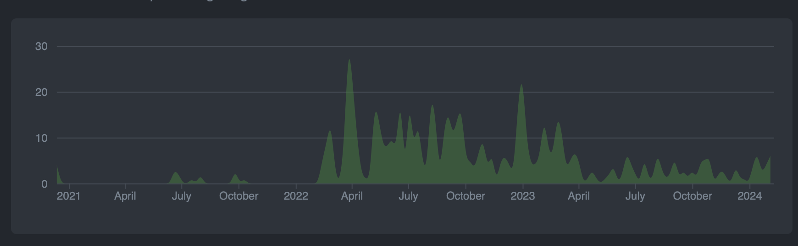
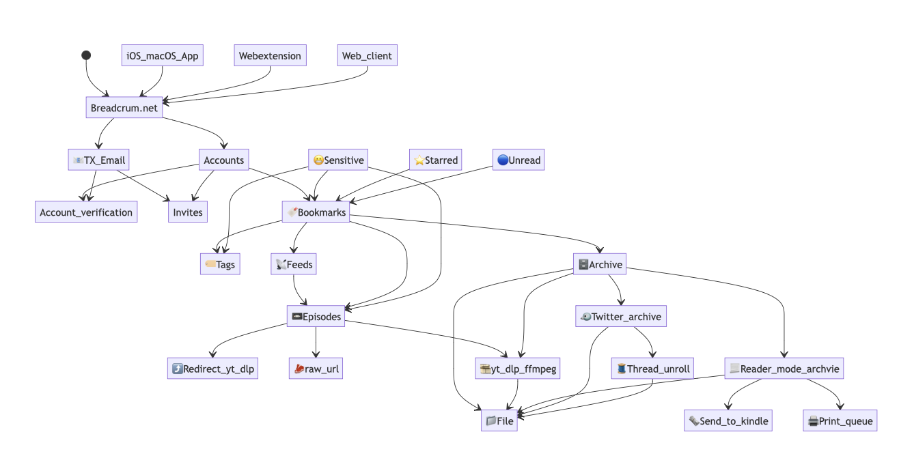

Happy 3rd year of Breadcrum! 🎉 Or has it only been 2?! When do you start the clock on these things? The first commit? The first user? The first sale? (Technically its not even launched yet!) Lets just call it January 2021.

<figure>
  
  <figcaption>Happy 3 years of Breadcrum.net! (Thought it doesn't look like things started really rolling until 2022.)</figcaption>
</figure>

|           | 2021 | 2022 | 2023 |
|-----------|------|------|------|
| Users     | 0    | 8    | 31   |
| Bookmarks | 0    | 2070 | 6304 |
| Tags      | 0    | 235  | 597  |
| Episodes  | 0    | 1175 | 3579 |
| Archives  | 0    | 0    | 1575 |

Breadcrum.net started in 2021 with a few simple sketches for a bookmarking schema and some loose ideas around archiving articles, audio and video from around the web.
The core concept was personal content archiving and media consumption tools wrapped around an "old-school" web 2.0 bookmarking service (like [del.icio.us](https://del.icio.us) or [pinboard.in](https://pinboard.in)). You can still read the [original design document](https://github.com/hifiwi-fi/breadcrum.net/wiki/Design-Document).

In other words: "Submit a URL, have it do something useful with that page, and save it to your account." For now, "something useful" means article content archiving, and send-media-to-your-phone in the form of a podcast.

The original idea for "send any media to your phone as a podcast" developed back in 2015 when [Ryan Barrett](https://snarfed.org/) launched ["huffduff-video"](https://snarfed.org/2015-03-07_huffduff-video). The idea for huffduff-video came out of a discussion I participated in on the indiewebcamp IRC channel and it was cool to see that idea come to life. And it worked really well!

Whenever I shared the tool with my non-technical friends though, they liked the idea of it, however the UX of bookmarklets on iPhones being what it is, and having manage a separate user account on huffduffer, I could never really onboard people to the tool.
A core goal of Breadcrum was to unify this concept into a user friendly tool that anyone can learn to use.

We're not there yet, but its getting close.

<figure>
  
  <figcaption>An early information hierarchy chart for what Breadcrum wanted to be. Glad I never got around to building for Twitter!</figcaption>
</figure>

I'm pleased to re-review this design document and conclude, I think the MVP has been achieved though! Breadcrum has shipped the following core features as of 2024:

- Bookmarking
- Tags
- Read/Unread State
- Episodes (Audio and Video)
- Article content Archives
- Full Text Search

The user experience could still use a lot of work, but core functionality is in.

## What happened in 2023?

Lots of good foundation was laid in 2022, and development slowed quite a bit in 2023.
Reflecting back on why this is, I think it boils down to two reasons: busy with life and work, and also I took time to just use and enjoy Breadcrum in its MVP state.

<figure>
  
  <figcaption>The view out of the new Breadcrum HQ</figcaption>
</figure>

With respect to life and work, I moved again at the tail end of 2022 and I also changed jobs, so most of my surplus engineering attention ended getting diverted to those two major changes.
Additionally my two kids graduated from babyhood to toddlerhood and require a lot more hands on Dad time on the weekends. Baby's sleep a lot, toddlers do not!

The the imminent feeling to rush development forward also waned, because I was able to use and enjoy Breadcrum nearly every day. With all MVP features in place, I finally have a tool for collecting media from around the web that I always wanted, so rather than working on it every day, I just enjoyed using it.

## 2024 Goals

My goal for 2024 is to spread some of the joy I had in 2023 using Breadcrum to a wider audience. There missing pieces that need to be built before that can happen:

- 💾 Cloud Storage
- 📙 Better Docs
- 💸 Paid Accounts
- 🎨 Improved add bookmark UI
- ⚖️ Async Job Queue Architecture
- 📦 Data Import and Export

A few other nice to have features are also on the radar:

- 🔑 Passkeys
- 👩‍🍼 Multiple episode feeds
- 📞 PWA Offline Support
- 📤 Send to ReMarkable
- 🗓️ Scheduled Episodes
- 🏹 Sharable Archives
- 🚀 iOS/Native App (Only way to get good UX on data sharing apps)

And finally, I should probably just launch the damn thing, have a day of it on Product Hunt, and generally spread the word.

Let's check in next year and see what ends up getting done.

If you want to see what immediate issues are being looked at, check out the [Breadcrum project board](https://github.com/orgs/hifiwi-fi/projects/1) over on GitHub.

